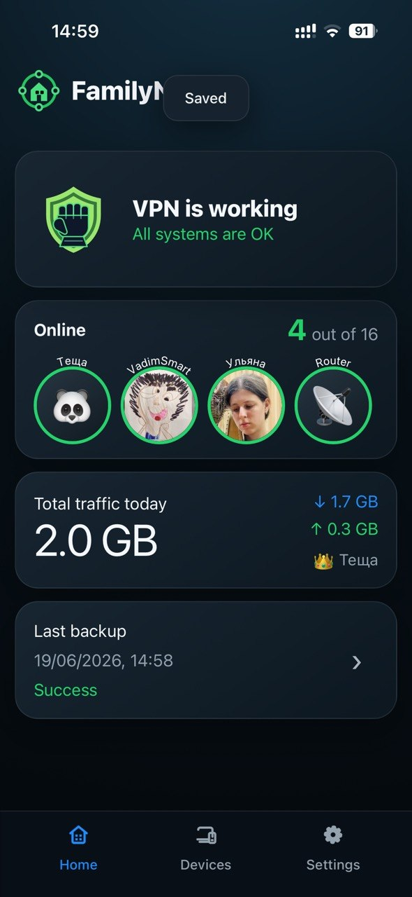
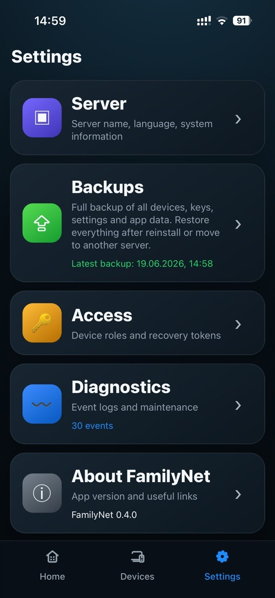
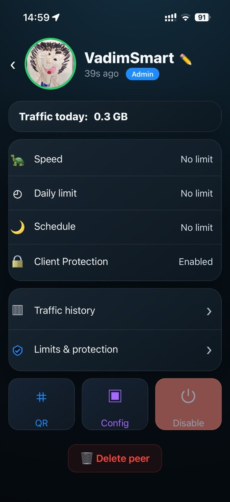
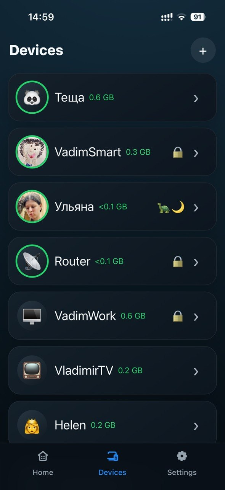
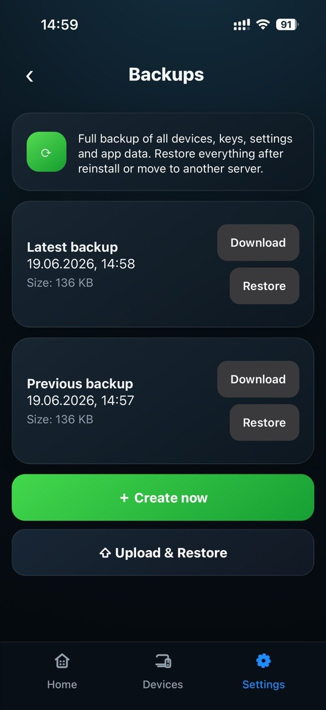

# FamilyNet VPN

Self-hosted management panel for a family WireGuard VPN server.

## Quick Start

After installation:

```
 1. Connect to WireGuard
 2. Open http://10.8.0.1:8000
```

**No password or token required.** If you are an admin VPN peer — the panel opens immediately.

```bash
bash <(curl -fsSL https://raw.githubusercontent.com/BattlemanV/familynet-vpn/main/install.sh)
```

---

## Features

- Client management (create/delete/rename)
- QR codes and WireGuard configs
- Roles (admin / user)
- Traffic statistics (today, week, month, all time)
- Activity log
- Backup / restore (tar.gz, auto on changes, upload max 100MB)
- Speed limits (symmetrical, upload + download)
- Parental control (daily limits, schedule, throttle)
- Manual override (slow mode / disable overrides parental)
- Online / offline indicator
- CPU, RAM, disk, uptime monitoring
- VPS reboot / WireGuard restart / panel restart
- Avatars (emoji + photo, localStorage)
- 7 languages: EN, RU, ZH, TR, FA, ES, HI

## Screenshots

| | |
|:-:|:-:|
|  |  |
|  |  |
|  | |

## Stack

- Docker (single container, python:3.11-slim)
- WireGuard
- FastAPI + Uvicorn
- PWA frontend (vanilla JS)
- SQLite (traffic history)

## Security

VPN-first architecture. The API binds to `10.8.0.1:8000` (WireGuard interface) only. No public exposure, no reverse proxy, no domain required. Admin access is granted by being an admin VPN peer — no password, no token for normal usage. A recovery token is generated for SSH/developer emergency access only.

## Quick Install

```bash
bash <(curl -fsSL https://raw.githubusercontent.com/BattlemanV/familynet-vpn/main/install.sh)
```

## Russian

Краткая инструкция на русском: [README.ru.md](README.ru.md)
